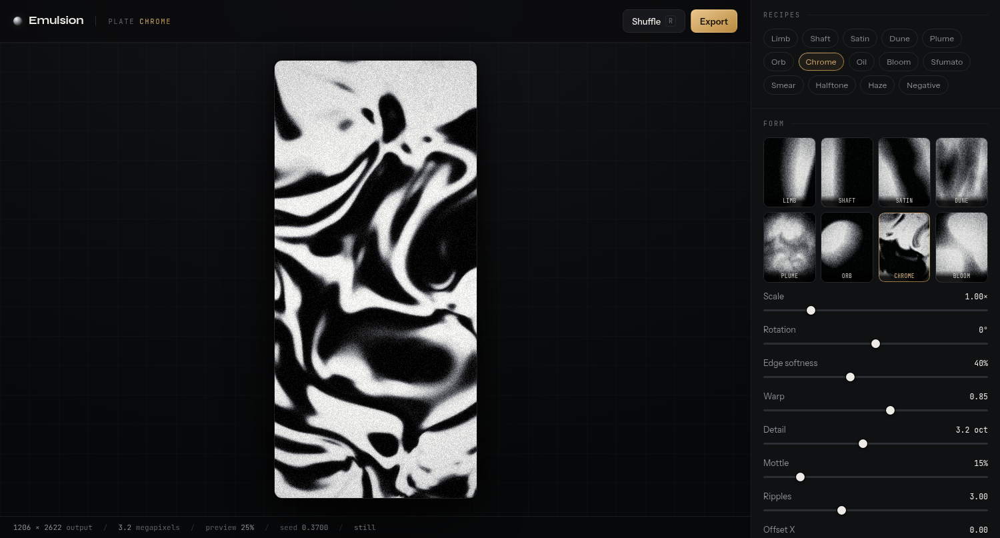
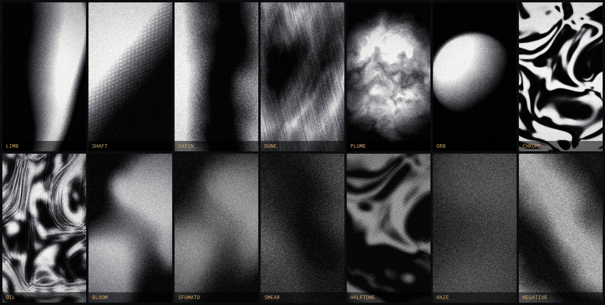

# Emulsion

**Generative grain plates for still and moving monochrome fields.**

A single-page WebGL2 tool for making the grainy, near-black gradient images that
fill phone wallpaper feeds — soft lit forms, folded satin, liquid chrome, light
shafts — with every part of the look under a slider, exported at any resolution.

🔗 **[emulsion.benmross.com](https://emulsion.benmross.com)**



---

## What it is

One fragment shader draws the whole image in a single pass. There is no photo
input, no library of textures, no upscaling: a scalar field is evaluated per
pixel, tone-mapped, colored, and grained at the exact output resolution you
export. A 4K plate is not a stretched preview — it is the same math sampled
more finely.

The pipeline, in order:

| Stage | What happens |
| --- | --- |
| **Field** | One of eight shape functions returns a luminance value for the pixel — a lit column, a beam, folded waves, ridges, smoke, a sphere, warped chrome contours, or merging blobs. Value-noise fBm with adjustable octaves drives the warping. |
| **Optics** | A 10-tap kernel blurs the field in scene units, stretchable along an axis for directional motion blur. Because it is applied to the field and not to pixels, blur is resolution-independent. |
| **Motion** | The field walks a closed path in noise space and band phase advances exactly 2π per loop, so an animation returns to frame one exactly — loops are seamless by construction, not by crossfade. |
| **Tone** | Exposure, black point, gamma, contrast pivot, gloss (a specular contour sharpener), vignette. |
| **Palette** | Luminance maps through a three-stop gradient — shadow, mid, light — with a movable mid stop and an invert. |
| **Grain** | Cell noise sized in *output* pixels, with density (what fraction of cells carry a speck) and midtone bias (film weights grain toward mid values; dial it down for grain that reaches into the shadows). Optional chroma grain. |
| **Surface** | An optional overlay: diagonal dashes, brushed streaks, weave, or a luminance-sized halftone dot screen applied after tone mapping. |

## Plates

Fourteen presets, each setting the full form/tone/grain stack:



## Exporting

- **Export** — one still as PNG, WebP, or JPEG at the configured resolution
  (up to 8192 px a side). PNG over 16 MB falls back to WebP automatically.
- **Export set** — 4–12 seed variations of the current look, back to back.
- **Record loop** — one full animation cycle captured off the canvas as MP4
  (H.264) where the browser supports it, WebM otherwise.

Presets cover iPhone 16 Pro (1206 × 2622) and Pro Max, common phone and desktop
sizes, and a 4:5 print ratio; any custom size works too.

## Wallpapers on iOS

iOS has no third-party live-wallpaper API — motion is possible only on the Lock
Screen, and only via a Live Photo. Two routes work:

**Animated Lock Screen.** Set *Loop length* to 3.0 s (Live Photos are ~3 s),
turn on *Animate*, and **Record loop**. Move the MP4 to the phone, convert it to
a Live Photo (intoLive or similar), then Settings → Wallpaper → Add New
Wallpaper → Photos, confirm the motion toggle is on, and Set as Wallpaper Pair.
The Home Screen still shows a frozen frame — that part is Apple's limit.

**Rotating stills.** **Export set** a batch, drop them into an album, then
Settings → Wallpaper → Add New Wallpaper → Photo Shuffle → Album, and pick a
shuffle frequency. For finer control, a Shortcuts *Time of Day* automation with
the **Set Wallpaper** action can swap plates on a schedule — that action needs a
plain Photo wallpaper, not a Photo Shuffle one.

The **Lock screen guides** toggle overlays the Dynamic Island, clock, widget
row, and bottom controls so the bright part of a plate can be placed where the
clock will not sit on it. Guides are preview-only and never exported.

## Running it

The build output is one self-contained file. Open it directly — no server, no
install:

```sh
xdg-open dist/index.html      # or: open dist/index.html
```

Saving from a `file://` copy writes straight to disk with no prompts, which is
the fastest way to run **Export set**.

## Building

`build.mjs` inlines the stylesheet, both shaders, and the JavaScript modules
into `dist/index.html`. It needs Node 18+ and has no dependencies:

```sh
node build.mjs
```

```
src/
├── index.html              page shell and markup
├── styles.css              full stylesheet (single dark theme)
├── shaders/
│   ├── plate.vert.glsl     3-vertex fullscreen triangle
│   └── plate.frag.glsl     field, optics, tone, palette, grain, surface
└── js/
    ├── 01-data.js          parameters, shapes, palettes, plates, sizes
    ├── 02-renderer.js      WebGL2 program and uniform upload
    ├── 03-stage.js         canvas sizing, paint loop, animation clock
    ├── 04-controls.js      control factory and the rail
    └── 05-actions.js       plates, shuffle, export, batch, recording
```

The JS modules are concatenated in filename order and share one top-level
scope, so ordering is load-bearing: data, then renderer, then stage, then
controls, then the actions that wire them together.

## Browser support

Needs WebGL2 — current Chrome, Firefox, Safari, and Edge all qualify. Loop
recording additionally needs `MediaRecorder` with canvas capture; the button
disables itself and says so where that is missing. Google Fonts is the only
external request.

## License

MIT — see [LICENSE](LICENSE).
